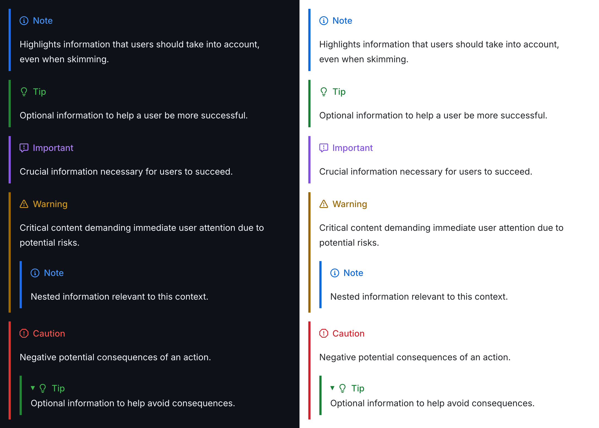
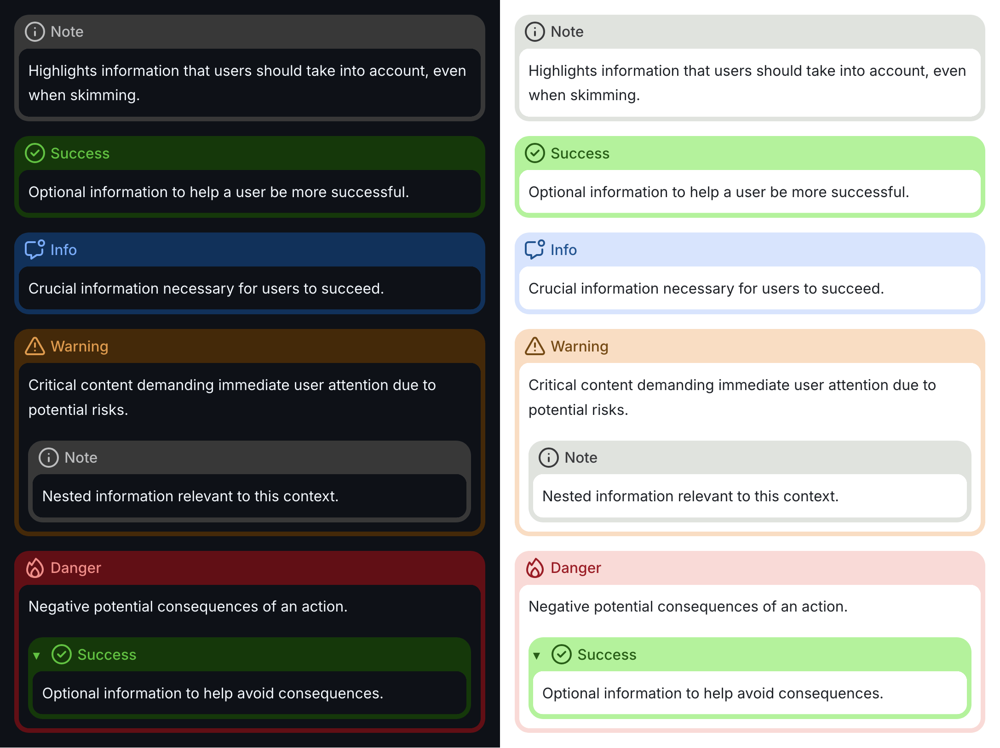
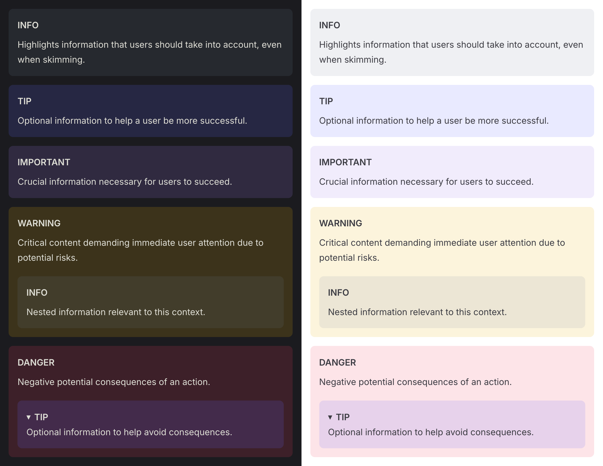

# remark-callout-directives

[](https://www.npmjs.com/package/@microflash/remark-callout-directives)
[](https://github.com/Microflash/remark-callout-directives/actions/workflows/regression.yml)
[](./LICENSE.md)

[remark](https://github.com/remarkjs/remark) plugin to render callouts with [directives](https://talk.commonmark.org/t/generic-directives-plugins-syntax/444)

- [What’s this?](#whats-this)
- [When should I use this?](#when-should-i-use-this)
- [Prerequisites](#prerequisites)
- [Install](#install)
- [Use](#use)
- [API](#api)
	- [Options](#options)
	- [Default options](#default-options)
	- [Themes](#themes)
- [Examples](#examples)
	- [Example: callout with custom title](#example-callout-with-custom-title)
	- [Example: callout with markdown title](#example-callout-with-markdown-title)
	- [Example: custom callouts](#example-custom-callouts)
	- [Example: configure aliases](#example-configure-aliases)
	- [Example: configure element type](#example-configure-element-type)
	- [Example: global and local element type configuration](#example-global-and-local-element-type-configuration)
	- [Example: override the defaults](#example-override-the-defaults)
	- [Example: remove the hint icon](#example-remove-the-hint-icon)
	- [Example: nested callouts](#example-nested-callouts)
	- [Example: collapsible callouts](#example-collapsible-callouts)
	- [Example: using a theme](#example-using-a-theme)
- [License](#license)

## What’s this?

This package is a [unified](https://github.com/unifiedjs/unified) ([remark](https://github.com/remarkjs/remark)) plugin to add support for callouts and admonitions using the [directives](https://talk.commonmark.org/t/generic-directives-plugins-syntax/444). It depends on [remark-directive](https://github.com/remarkjs/remark-directive) which must be included before this plugin.

## When should I use this?

Callouts are used to provide additional information related to a topic under discussion or draw out attention to potential possibilities. They are widely used in documentation by popular libraries, frameworks, and applications (such as [Starlight](https://starlight.astro.build/components/asides/), [Obsidian](https://help.obsidian.md/callouts), [Bear](https://bear.app/faq/callouts/) and so on). Use this plugin if you need something similar.

## Prerequisites

You should import [`remark-directive`](https://github.com/remarkjs/remark-directive) before this plugin for callouts to work.

## Install

This package is [ESM only](https://gist.github.com/sindresorhus/a39789f98801d908bbc7ff3ecc99d99c).

In Node.js (version 16.0+), install with [npm](https://docs.npmjs.com/cli/install):

```sh
npm install @microflash/remark-callout-directives
```

In Deno, with [esm.sh](https://esm.sh/):

```js
import remarkCalloutDirectives from "https://esm.sh/@microflash/remark-callout-directives"
```

In browsers, with [esm.sh](https://esm.sh/):

```html
<script type="module">
  import remarkCalloutDirectives from "https://esm.sh/@microflash/remark-callout-directives?bundle"
</script>
```

## Use

Say we have the following file `example.md`:

```md
:::note
Some **content** with _Markdown_ `syntax`.
:::
```

And our module `example.js` looks as follows:

```js
import { read } from "to-vfile"
import { unified } from "unified"
import remarkParse from "remark-parse"
import remarkDirective from "remark-directive"
import remarkCalloutDirectives from "@microflash/remark-callout-directives"
import remarkRehype from "remark-rehype"
import rehypeStringify from "rehype-stringify"

main()

async function main() {
  const file = await unified()
    .use(remarkParse)
    .use(remarkDirective)
    .use(remarkCalloutDirectives)
    .use(remarkRehype, { allowDangerousHtml: true })
    .use(rehypeStringify, { allowDangerousHtml: true })
    .process(await read("example.md"))

  console.log(String(file))
}
```

Running that with `node example.js` yields:

```html
<aside class="callout callout-note">
  <div class="callout-indicator">
    <div class="callout-hint">
      <svg xmlns="http://www.w3.org/2000/svg" width="24" height="24" viewBox="0 0 24 24" fill="none" stroke="currentColor" stroke-linecap="round" stroke-linejoin="round" stroke-width="2" aria-hidden="true"><path d="M12 8h.01M12 12v4"/><circle cx="12" cy="12" r="10"/></svg>
    </div>
    <div class="callout-title">Note</div>
  </div>
  <div class="callout-content">
    <p>Some <strong>content</strong> with <em>Markdown</em> <code>syntax</code>.</p>
  </div>
</aside>
```

## API

The default export is `remarkCalloutDirectives`.

### Options

You can provide the following options. All of them are optional.

- `aliases`: a map of aliases to an existing callout type
- `callouts`: an object containing the callout definitions, each definition containing the following properties:
  - `title`: the display title of the callout
  - `hint`: optional SVG icon representing the callout type
  - `tagName`: optional HTML tag name for the callout wrapper (overrides the global `tagName` configuration)
- `tagName`: global HTML tag name used for wrapping the callout (default: `aside`)
- `generate(title, children, prefs)`: optional function that creates the [MDAST](https://github.com/syntax-tree/mdast) representation of a callout body. This function receives three inputs:
  - `title`: the callout title (can be plaintext or markdown)
  - `children`: array of MDAST nodes representing the content inside the callout
  - `prefs`: preferences for generating the callout. The default `generate` function supports the following preferences:
    - `hint`: optional SVG icon representing the callout type
    - `collapsible`: whether the callout is collapsible (default: `false`), only `true` when tagName is `details`
    - `showHint`: whether to display the hint icon (default: `true`)

You can implement your own `generate` function to completely control the layout of the callout body. An example of such an implementation is available under Vitepress theme.

<https://github.com/Microflash/remark-callout-directives/blob/42d6d04938edb97f23945e3ed0d9ffff8d07b0fd/src/themes/vitepress/index.js#L22-L77>

### Default options

By default, the following callouts and aliases are preconfigured.

<https://github.com/Microflash/remark-callout-directives/blob/42d6d04938edb97f23945e3ed0d9ffff8d07b0fd/src/index.js#L46-L157>

### Themes

To style the callouts, import a theme from [`themes`](./src/themes/) folder.

#### [GitHub](./src/themes/github/)



#### [Microflash](./src/themes/microflash/)



#### [VitePress](./src/themes/vitepress/)



For more advanced customizations, take a look at the existing themes and remix your own.

## Examples

### Example: callout with custom title

Say we have the following file `example.md`:

```md
:::warn{title="Hold on there"}
Some **content** with _Markdown_ `syntax`.
:::
```

Running `example.js` will yield:

```html
<aside class="callout callout-warn">
  <div class="callout-indicator">
    <div class="callout-hint">
      <svg xmlns="http://www.w3.org/2000/svg" width="24" height="24" viewBox="0 0 24 24" fill="none" stroke="currentColor" stroke-linecap="round" stroke-linejoin="round" stroke-width="2" aria-hidden="true"><path d="m21.73 18-8-14a2 2 0 0 0-3.48 0l-8 14A2 2 0 0 0 4 21h16a2 2 0 0 0 1.73-3M12 9v4m0 4h.01"/></svg>
    </div>
    <div class="callout-title">Hold on there</div>
  </div>
  <div class="callout-content">
    <p>Some <strong>content</strong> with <em>Markdown</em> <code>syntax</code>.</p>
  </div>
</aside>
```

### Example: callout with markdown title

Say we have the following file `example.md`:

```md
:::warn{title="**Hold** on _there_!"}
Some **content** with _Markdown_ `syntax`.
:::
```

Running `example.js` will yield:

```html
<aside class="callout callout-warn">
  <div class="callout-indicator">
    <div class="callout-hint">
      <svg xmlns="http://www.w3.org/2000/svg" width="24" height="24" viewBox="0 0 24 24" fill="none" stroke="currentColor" stroke-linecap="round" stroke-linejoin="round" stroke-width="2" aria-hidden="true"><path d="m21.73 18-8-14a2 2 0 0 0-3.48 0l-8 14A2 2 0 0 0 4 21h16a2 2 0 0 0 1.73-3M12 9v4m0 4h.01"/></svg>
    </div>
    <div class="callout-title"><strong>Hold</strong> on <em>there</em>!</div>
  </div>
  <div class="callout-content">
    <p>Some <strong>content</strong> with <em>Markdown</em> <code>syntax</code>.</p>
  </div>
</aside>
```

### Example: custom callouts

You can add your own callouts as well. Say we have the following file `example.md`:

```md
:::shoutout{title="Well done!"}
Some **content** with _Markdown_ `syntax`.
:::
```

And our module `example.js` looks as follows:

```js
import { read } from "to-vfile"
import { unified } from "unified"
import remarkParse from "remark-parse"
import remarkDirective from "remark-directive"
import remarkCalloutDirectives from "@microflash/remark-callout-directives"
import remarkRehype from "remark-rehype"
import rehypeStringify from "rehype-stringify"

main()

async function main() {
  const file = await unified()
    .use(remarkParse)
    .use(remarkDirective)
    .use(remarkCalloutDirectives, {
      callouts: {
        shoutout: {
          title: "Shoutout",
          hint: `<svg xmlns="http://www.w3.org/2000/svg" width="24" height="24" viewBox="0 0 24 24" fill="none" stroke="currentColor" stroke-linecap="round" stroke-linejoin="round" stroke-width="2"><path d="M4.7 6.5h.01m8.49-2.8h.01m4.29 15.6h.01m2.79-8.5h.01m-6.41-.7 2.2-.7V6.5h2.8V3.7L21 3m-6.253 10.767c1.676-.175 2.93-.38 3.739-.064 1.234.483 1.497 1.529 1.409 3.008m-9.723-7.519c.175-1.676.38-2.93.064-3.739-.483-1.234-1.529-1.497-3.008-1.409M6.5 10.4l7.1 7.1L3 21z"/></svg>`
        }
      }
    })
    .use(remarkRehype, { allowDangerousHtml: true })
    .use(rehypeStringify, { allowDangerousHtml: true })
    .process(await read("example.md"))

  console.log(String(file))
}
```

Running `example.js` will yield:

```html
<aside class="callout callout-shoutout">
  <div class="callout-indicator">
    <div class="callout-hint">
      <svg xmlns="http://www.w3.org/2000/svg" width="24" height="24" viewBox="0 0 24 24" fill="none" stroke="currentColor" stroke-linecap="round" stroke-linejoin="round" stroke-width="2"><path d="M4.7 6.5h.01m8.49-2.8h.01m4.29 15.6h.01m2.79-8.5h.01m-6.41-.7 2.2-.7V6.5h2.8V3.7L21 3m-6.253 10.767c1.676-.175 2.93-.38 3.739-.064 1.234.483 1.497 1.529 1.409 3.008m-9.723-7.519c.175-1.676.38-2.93.064-3.739-.483-1.234-1.529-1.497-3.008-1.409M6.5 10.4l7.1 7.1L3 21z"/></svg>
    </div>
    <div class="callout-title">Well done!</div>
  </div>
  <div class="callout-content">
    <p>Some <strong>content</strong> with <em>Markdown</em> <code>syntax</code>.</p>
  </div>
</aside>
```

### Example: configure aliases

Say we have the following file `example.md`:

```md
:::danger
Some **content** with _Markdown_ `syntax`.
:::
```

And our module `example.js` looks as follows:

```js
import { read } from "to-vfile"
import { unified } from "unified"
import remarkParse from "remark-parse"
import remarkDirective from "remark-directive"
import remarkCalloutDirectives from "@microflash/remark-callout-directives"
import remarkRehype from "remark-rehype"
import rehypeStringify from "rehype-stringify"

main()

async function main() {
  const file = await unified()
    .use(remarkParse)
    .use(remarkDirective)
    .use(remarkCalloutDirectives, {
      aliases: {
        danger: "deter"
      }
    })
    .use(remarkRehype, { allowDangerousHtml: true })
    .use(rehypeStringify, { allowDangerousHtml: true })
    .process(await read("example.md"))

  console.log(String(file))
}
```

Running that with `node example.js` yields:

```html
<aside class="callout callout-deter">
  <div class="callout-indicator">
    <div class="callout-hint">
      <svg xmlns="http://www.w3.org/2000/svg" width="24" height="24" viewBox="0 0 24 24" fill="none" stroke="currentColor" stroke-linecap="round" stroke-linejoin="round" stroke-width="2" aria-hidden="true"><path d="M12 12s-5.6 4.6-3.6 8c1.6 2.6 5.7 2.7 7.2 0 2-3.7-3.6-8-3.6-8Z"/><path d="M13.004 2 8.5 9 6.001 6s-4.268 7.206-1.629 11.8c3.016 5.5 11.964 5.7 15.08 0C23.876 10 13.004 2 13.004 2Z"/></svg>
    </div>
    <div class="callout-title">Danger</div>
  </div>
  <div class="callout-content">
    <p>Some <strong>content</strong> with <em>Markdown</em> <code>syntax</code>.</p>
  </div>
</aside>
```

### Example: configure element type

By default, a callout is rendered as an [`aside`](https://developer.mozilla.org/en-US/docs/Web/HTML/Element/aside). You can override this behavior by providing `is` property on demand.

Say we have the following file `example.md`:

```md
:::assert{is="blockquote"}
Some **content** with _Markdown_ `syntax`.
:::
```

Running the `example.js` yields:

```html
<blockquote class="callout callout-assert">
  <div class="callout-indicator">
    <div class="callout-hint">
      <svg xmlns="http://www.w3.org/2000/svg" width="24" height="24" viewBox="0 0 24 24" fill="none" stroke="currentColor" stroke-linecap="round" stroke-linejoin="round" stroke-width="2" aria-hidden="true"><circle cx="19" cy="5" r="3"/><path d="M20 11.929V15c0 1.656-1.344 3-3 3h-3l-6 4v-4H5c-1.656 0-3-1.344-3-3V7c0-1.656 1.344-3 3-3h7.071"/></svg>
    </div>
    <div class="callout-title">Info</div>
  </div>
  <div class="callout-content">
    <p>Some <strong>content</strong> with <em>Markdown</em> <code>syntax</code>.</p>
  </div>
</blockquote>
```

You can override this behavior for all instances of a specific callout by providing a `tagName` for that callout.

Say we have the following file `example.md`:

```md
:::assert
Some **content** with _Markdown_ `syntax`.
:::
```

And our module `example.js` looks as follows:

```js
import { read } from "to-vfile"
import { unified } from "unified"
import remarkParse from "remark-parse"
import remarkDirective from "remark-directive"
import remarkCalloutDirectives from "@microflash/remark-callout-directives"
import remarkRehype from "remark-rehype"
import rehypeStringify from "rehype-stringify"

main()

async function main() {
  const file = await unified()
    .use(remarkParse)
    .use(remarkDirective)
    .use(remarkCalloutDirectives, {
      callouts: {
        assert: {
          tagName: "div"
        }
      }
    })
    .use(remarkRehype, { allowDangerousHtml: true })
    .use(rehypeStringify, { allowDangerousHtml: true })
    .process(await read("example.md"))

  console.log(String(file))
}
```

Running that with `node example.js` yields:

```html
<div class="callout callout-assert">
  <div class="callout-indicator">
    <div class="callout-hint">
      <svg xmlns="http://www.w3.org/2000/svg" width="24" height="24" viewBox="0 0 24 24" fill="none" stroke="currentColor" stroke-linecap="round" stroke-linejoin="round" stroke-width="2" aria-hidden="true"><circle cx="19" cy="5" r="3"/><path d="M20 11.929V15c0 1.656-1.344 3-3 3h-3l-6 4v-4H5c-1.656 0-3-1.344-3-3V7c0-1.656 1.344-3 3-3h7.071"/></svg>
    </div>
    <div class="callout-title">Info</div>
  </div>
  <div class="callout-content">
    <p>Some <strong>content</strong> with <em>Markdown</em> <code>syntax</code>.</p>
  </div>
</div>
```

You can override the element type of all callouts by providing a `tagName`.

Say we have the following file `example.md`:

```md
:::assert
Some **content** with _Markdown_ `syntax`.
:::
```

And our module `example.js` looks as follows:

```js
import { read } from "to-vfile"
import { unified } from "unified"
import remarkParse from "remark-parse"
import remarkDirective from "remark-directive"
import remarkCalloutDirectives from "@microflash/remark-callout-directives"
import remarkRehype from "remark-rehype"
import rehypeStringify from "rehype-stringify"

main()

async function main() {
  const file = await unified()
    .use(remarkParse)
    .use(remarkDirective)
    .use(remarkCalloutDirectives, {
      tagName: "div"
    })
    .use(remarkRehype, { allowDangerousHtml: true })
    .use(rehypeStringify, { allowDangerousHtml: true })
    .process(await read("example.md"))

  console.log(String(file))
}
```

Running that with `node example.js` yields:

```html
<div class="callout callout-assert">
  <div class="callout-indicator">
    <div class="callout-hint">
      <svg xmlns="http://www.w3.org/2000/svg" width="24" height="24" viewBox="0 0 24 24" fill="none" stroke="currentColor" stroke-linecap="round" stroke-linejoin="round" stroke-width="2" aria-hidden="true"><circle cx="19" cy="5" r="3"/><path d="M20 11.929V15c0 1.656-1.344 3-3 3h-3l-6 4v-4H5c-1.656 0-3-1.344-3-3V7c0-1.656 1.344-3 3-3h7.071"/></svg>
    </div>
    <div class="callout-title">Info</div>
  </div>
  <div class="callout-content">
    <p>Some <strong>content</strong> with <em>Markdown</em> <code>syntax</code>.</p>
  </div>
</div>
```

### Example: global and local element type configuration

You can mix the `tagName` and `is` configurations globally and specifically for a callout.

Say we have the following file `example.md`:

```md
:::tip{is="blockquote"}
Some **content** with _Markdown_ `syntax`.
:::

:::assert
Some **content** with _Markdown_ `syntax`.
:::

:::note
Some **content** with _Markdown_ `syntax`.
:::
```

And our module `example.js` looks as follows:

```js
import { read } from "to-vfile"
import { unified } from "unified"
import remarkParse from "remark-parse"
import remarkDirective from "remark-directive"
import remarkCalloutDirectives from "@microflash/remark-callout-directives"
import remarkRehype from "remark-rehype"
import rehypeStringify from "rehype-stringify"

main()

async function main() {
  const file = await unified()
    .use(remarkParse)
    .use(remarkDirective)
    .use(remarkCalloutDirectives, {
      tagName: "div",
      callouts: {
        note: {
          tagName: "aside"
        }
      }
    })
    .use(remarkRehype, { allowDangerousHtml: true })
    .use(rehypeStringify, { allowDangerousHtml: true })
    .process(await read("example.md"))

  console.log(String(file))
}
```

Running that with `node example.js` yields:

```html
<blockquote class="callout callout-commend">
  <div class="callout-indicator">
    <div class="callout-hint">
      <svg xmlns="http://www.w3.org/2000/svg" width="24" height="24" viewBox="0 0 24 24" fill="none" stroke="currentColor" stroke-linecap="round" stroke-linejoin="round" stroke-width="2" aria-hidden="true"><path d="m8 12 2.7 2.7L16 9.3"/><circle cx="12" cy="12" r="10"/></svg>
    </div>
    <div class="callout-title">Success</div>
  </div>
  <div class="callout-content">
    <p>Some <strong>content</strong> with <em>Markdown</em> <code>syntax</code>.</p>
  </div>
</blockquote>

<div class="callout callout-assert">
  <div class="callout-indicator">
    <div class="callout-hint">
      <svg xmlns="http://www.w3.org/2000/svg" width="24" height="24" viewBox="0 0 24 24" fill="none" stroke="currentColor" stroke-linecap="round" stroke-linejoin="round" stroke-width="2" aria-hidden="true"><circle cx="19" cy="5" r="3"/><path d="M20 11.929V15c0 1.656-1.344 3-3 3h-3l-6 4v-4H5c-1.656 0-3-1.344-3-3V7c0-1.656 1.344-3 3-3h7.071"/></svg>
    </div>
    <div class="callout-title">Info</div>
  </div>
  <div class="callout-content">
    <p>Some <strong>content</strong> with <em>Markdown</em> <code>syntax</code>.</p>
  </div>
</div>

<aside class="callout callout-note">
  <div class="callout-indicator">
    <div class="callout-hint">
      <svg xmlns="http://www.w3.org/2000/svg" width="24" height="24" viewBox="0 0 24 24" fill="none" stroke="currentColor" stroke-linecap="round" stroke-linejoin="round" stroke-width="2" aria-hidden="true"><path d="M12 8h.01M12 12v4"/><circle cx="12" cy="12" r="10"/></svg>
    </div>
    <div class="callout-title">Note</div>
  </div>
  <div class="callout-content">
    <p>Some <strong>content</strong> with <em>Markdown</em> <code>syntax</code>.</p>
  </div>
</aside>
```

### Example: override the defaults

You can override the defaults by passing your own preferences; they will be merged on top of the default values.

Say we have the following file `example.md`:

```md
:::commend
Some **content** with _Markdown_ `syntax`.
:::
```

And our module `example.js` looks as follows:

```js
import { read } from "to-vfile"
import { unified } from "unified"
import remarkParse from "remark-parse"
import remarkDirective from "remark-directive"
import remarkCalloutDirectives from "@microflash/remark-callout-directives"
import remarkRehype from "remark-rehype"
import rehypeStringify from "rehype-stringify"

main()

async function main() {
  const file = await unified()
    .use(remarkParse)
    .use(remarkDirective)
    .use(remarkCalloutDirectives, {
      callouts: {
        commend: {
          title: "Tip",
          hint: `<svg xmlns="http://www.w3.org/2000/svg" width="24" height="24" viewBox="0 0 24 24" fill="none" stroke="currentColor" stroke-linecap="round" stroke-linejoin="round" stroke-width="2"><path d="M22 11.08V12a10 10 0 1 1-5.93-9.14"/><path d="M22 4 12 14.01l-3-3"/></svg>`
        }
      }
    })
    .use(remarkRehype, { allowDangerousHtml: true })
    .use(rehypeStringify, { allowDangerousHtml: true })
    .process(await read("example.md"))

  console.log(String(file))
}
```

Running that with `node example.js` yields:

```html
<aside class="callout callout-commend">
  <div class="callout-indicator">
    <div class="callout-hint">
      <svg xmlns="http://www.w3.org/2000/svg" width="24" height="24" viewBox="0 0 24 24" fill="none" stroke="currentColor" stroke-linecap="round" stroke-linejoin="round" stroke-width="2"><path d="M22 11.08V12a10 10 0 1 1-5.93-9.14"/><path d="M22 4 12 14.01l-3-3"/></svg>
    </div>
    <div class="callout-title">Tip</div>
  </div>
  <div class="callout-content">
    <p>Some <strong>content</strong> with <em>Markdown</em> <code>syntax</code>.</p>
  </div>
</aside>
```

### Example: remove the hint icon

You can remove the hint icon using the `showHint="false"` property on a callout.

Say we have the following file `example.md`:

```md
:::note{showHint="false"}
Some **content** with _Markdown_ `syntax`.
:::
```

And our module `example.js` looks as follows:

```js
import { read } from "to-vfile"
import { unified } from "unified"
import remarkParse from "remark-parse"
import remarkDirective from "remark-directive"
import remarkCalloutDirectives from "@microflash/remark-callout-directives"
import remarkRehype from "remark-rehype"
import rehypeStringify from "rehype-stringify"

main()

async function main() {
  const file = await unified()
    .use(remarkParse)
    .use(remarkDirective)
    .use(remarkCalloutDirectives)
    .use(remarkRehype, { allowDangerousHtml: true })
    .use(rehypeStringify, { allowDangerousHtml: true })
    .process(await read("example.md"))

  console.log(String(file))
}
```

Running that with `node example.js` yields:

```html
<aside class="callout callout-note">
  <div class="callout-indicator">
    <div class="callout-title">Note</div>
  </div>
  <div class="callout-content">
    <p>Some <strong>content</strong> with <em>Markdown</em> <code>syntax</code>.</p>
  </div>
</aside>
```

### Example: nested callouts

You can nest the callouts within each other. Make sure to add additional colons `:` to disambiguate them.

Say we have the following file `example.md`:

```md
::::warn
Critical content demanding immediate user attention due to potential risks.

:::note
Nested information relevant to this context.
:::
::::
```

Running this with `node example.js` yields:

```html
<aside class="callout callout-warn">
  <div class="callout-indicator">
    <div class="callout-hint">
      <svg xmlns="http://www.w3.org/2000/svg" width="24" height="24" viewBox="0 0 24 24" fill="none" stroke="currentColor" stroke-linecap="round" stroke-linejoin="round" stroke-width="2" aria-hidden="true"><path d="m21.73 18-8-14a2 2 0 0 0-3.48 0l-8 14A2 2 0 0 0 4 21h16a2 2 0 0 0 1.73-3M12 9v4m0 4h.01"/></svg>
    </div>
    <div class="callout-title">Warning</div>
  </div>
  <div class="callout-content">
    <p>Critical content demanding immediate user attention due to potential risks.</p>
    <aside class="callout callout-note">
      <div class="callout-indicator">
        <div class="callout-hint">
          <svg xmlns="http://www.w3.org/2000/svg" width="24" height="24" viewBox="0 0 24 24" fill="none" stroke="currentColor" stroke-linecap="round" stroke-linejoin="round" stroke-width="2" aria-hidden="true"><path d="M12 8h.01M12 12v4"/><circle cx="12" cy="12" r="10"/></svg>
        </div>
        <div class="callout-title">Note</div>
      </div>
      <div class="callout-content">
        <p>Nested information relevant to this context.</p>
      </div>
    </aside>
  </div>
</aside>
```

### Example: collapsible callouts

You can make a callout collapsible by setting the `tagName` or `is` property to `details`. By default, such a callout is collapsed but you can initialize it as open using `open` property.

Say we have the following file `example.md`:

```md
:::deter{is="details"}
This is a collapsed callout.
:::

:::commend{is="details" open}
This is a collapsible callout that is open by default.
:::
```

Running this with `node example.js` yields:

```html
<details class="callout callout-deter">
  <summary>
    <div class="callout-indicator">
      <div class="callout-hint">
        <svg xmlns="http://www.w3.org/2000/svg" width="24" height="24" viewBox="0 0 24 24" fill="none" stroke="currentColor" stroke-linecap="round" stroke-linejoin="round" stroke-width="2" aria-hidden="true"><path d="M12 12s-5.6 4.6-3.6 8c1.6 2.6 5.7 2.7 7.2 0 2-3.7-3.6-8-3.6-8Z"/><path d="M13.004 2 8.5 9 6.001 6s-4.268 7.206-1.629 11.8c3.016 5.5 11.964 5.7 15.08 0C23.876 10 13.004 2 13.004 2Z"/></svg>
      </div>
      <div class="callout-title">Danger</div>
    </div>
  </summary>
  <div class="callout-content">
    <p>This is a collapsed callout.</p>
  </div>
</details>

<details open class="callout callout-commend">
  <summary>
    <div class="callout-indicator">
      <div class="callout-hint">
        <svg xmlns="http://www.w3.org/2000/svg" width="24" height="24" viewBox="0 0 24 24" fill="none" stroke="currentColor" stroke-linecap="round" stroke-linejoin="round" stroke-width="2"><path d="M22 11.08V12a10 10 0 1 1-5.93-9.14"/><path d="M22 4 12 14.01l-3-3"/></svg>
      </div>
      <div class="callout-title">Tip</div>
    </div>
  </summary>
  <div class="callout-content">
    <p>This is a collapsible callout that is open by default.</p>
  </div>
</details>
```

### Example: using a theme

Say, you want to use the [GitHub](./src/themes/github/) theme.

First, import the options for this theme and pass it to the plugin as follows.

```js
import { read } from "to-vfile"
import { unified } from "unified"
import remarkParse from "remark-parse"
import remarkDirective from "remark-directive"
import remarkCalloutDirectives from "@microflash/remark-callout-directives"
import githubCalloutOptions from "@microflash/remark-callout-directives/config/github"
import remarkRehype from "remark-rehype"
import rehypeStringify from "rehype-stringify"

main()

async function main() {
  const file = await unified()
    .use(remarkParse)
    .use(remarkDirective)
    .use(remarkCalloutDirectives, githubCalloutOptions)
    .use(remarkRehype, { allowDangerousHtml: true })
    .use(rehypeStringify, { allowDangerousHtml: true })
    .process(await read("example.md"))

  console.log(String(file))
}
```

Finally, import the CSS file. If you've an entrypoint file in your application, you can import the CSS as follows.

```js
import "@microflash/remark-callout-directives/theme/github"
// or using URL import
import "https://unpkg.com/@microflash/remark-callout-directives/src/themes/github/index.css"
```

If you're bundling the CSS files using a bundler, you can import the CSS in your main CSS file containing other imports.

```css
/* other imports... */
@import "@microflash/remark-callout-directives/theme/github";
```

If you're using Sass, you can import the CSS in your main Sass file.

```scss
// other Sass imports
@use "@microflash/remark-callout-directives/theme/github";
```

You can also import the CSS file directly in browsers, with [unpkg.com](https://unpkg.com) or [jsdelivr.net](https://jsdelivr.net):

```html
<link rel="stylesheet" href="https://unpkg.com/@microflash/remark-callout-directives/src/themes/github/index.css">
<link rel="stylesheet" href="https://cdn.jsdelivr.net/npm/@microflash/remark-callout-directives/src/themes/github/index.css">
```

## License

[MIT](./LICENSE.md)
