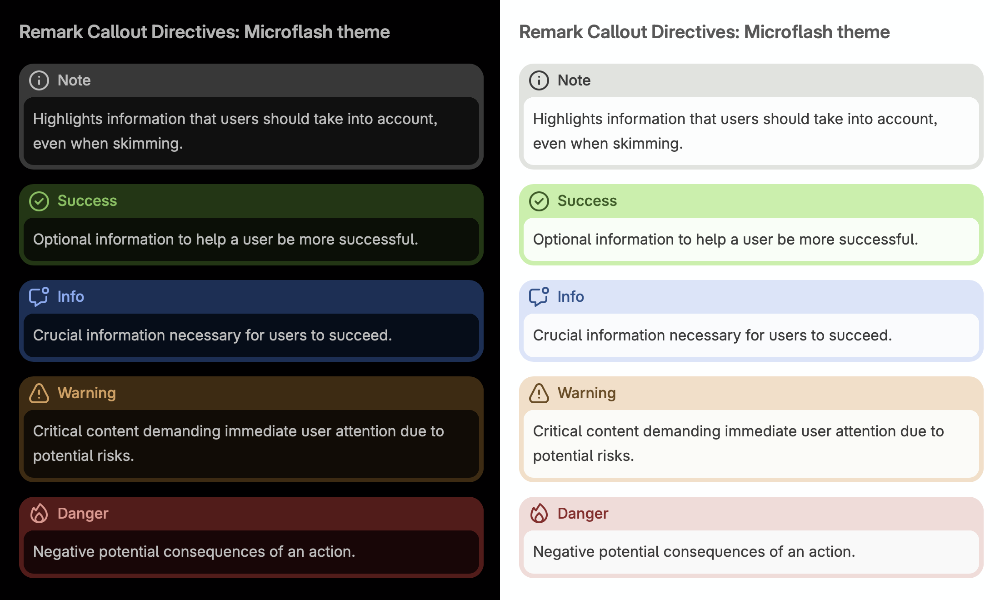
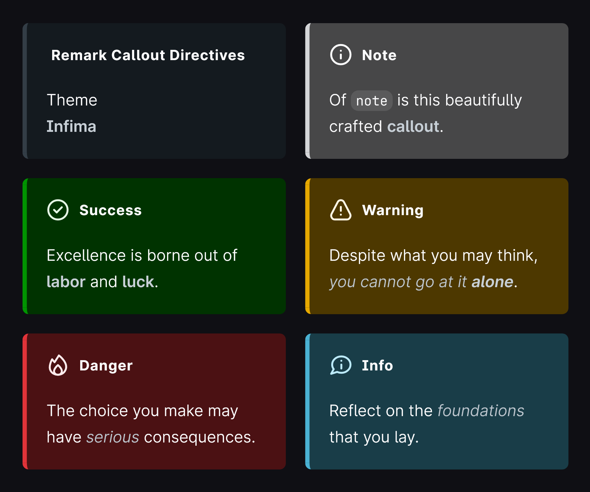
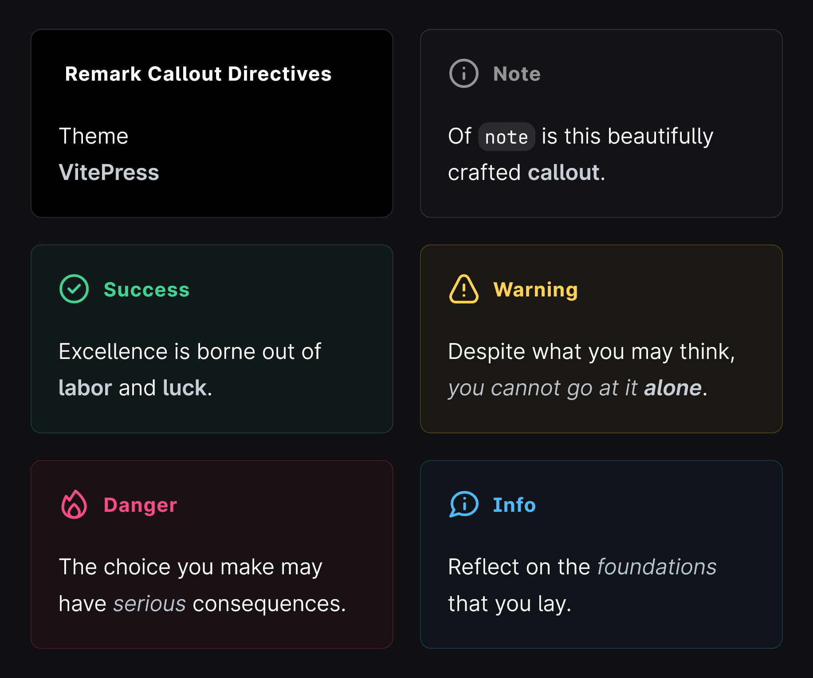

# remark-callout-directives

[](https://www.npmjs.com/package/@microflash/remark-callout-directives)
[](https://github.com/Microflash/remark-callout-directives/actions/workflows/regression.yml)
[](./LICENSE.md)

[remark](https://github.com/remarkjs/remark) plugin to render callouts and admonitions with [directives](https://talk.commonmark.org/t/generic-directives-plugins-syntax/444)

## Contents

- [What’s this?](#whats-this)
- [When should I use this?](#when-should-i-use-this)
- [Prerequisites](#prerequisites)
- [Install](#install)
- [Use](#use)
- [API](#api)
	- [Options](#options)
	- [Default options](#default-options)
	- [Themes](#themes)
- [Examples](#examples)
	- [Example: callout with custom title](#example-callout-with-custom-title)
	- [Example: callout with markdown title](#example-callout-with-markdown-title)
	- [Example: custom callouts](#example-custom-callouts)
	- [Example: configure aliases](#example-configure-aliases)
	- [Example: configure element type](#example-configure-element-type)
	- [Example: override the defaults](#example-override-the-defaults)
- [License](#license)

## What’s this?

This package is a [unified](https://github.com/unifiedjs/unified) ([remark](https://github.com/remarkjs/remark)) plugin to add support for callouts and admonitions using the [directives](https://talk.commonmark.org/t/generic-directives-plugins-syntax/444). It depends on [remark-directive](https://github.com/remarkjs/remark-directive) which must be included before this plugin.

## When should I use this?

Callouts and admonitions are used to provide additional information related to a topic under discussion or draw out attention to potential possibilities. They are widely used in documentation by popular libraries, frameworks, and applications (for example, [Docusaurus](https://docusaurus.io/docs/markdown-features/admonitions), [Obsidian](https://help.obsidian.md/How+to/Use+callouts), etc). Use this plugin if you need something similar.

## Prerequisites

You should import [`remark-directive`](https://github.com/remarkjs/remark-directive) before this plugin for callouts to work.

## Install

This package is [ESM only](https://gist.github.com/sindresorhus/a39789f98801d908bbc7ff3ecc99d99c).

In Node.js (version 12.20+, 14.14+, or 16.0+), install with [npm](https://docs.npmjs.com/cli/install):

```sh
npm install @microflash/remark-callout-directives
```

In Deno, with [esm.sh](https://esm.sh/):

```js
import remarkCalloutDirectives from 'https://esm.sh/@microflash/remark-callout-directives'
```

In browsers, with [esm.sh](https://esm.sh/):

```html
<script type="module">
  import remarkCalloutDirectives from 'https://esm.sh/@microflash/remark-callout-directives?bundle'
</script>
```

## Use

Say we have the following file `example.md`:

```md
:::note
Some **content** with _Markdown_ `syntax`.
:::
```

And our module `example.js` looks as follows:

```js
import { read } from "to-vfile"
import { unified } from "unified"
import remarkParse from "remark-parse"
import remarkDirective from "remark-directive"
import remarkCalloutDirectives from "@microflash/remark-callout-directives"
import remarkRehype from "remark-rehype"
import rehypeStringify from "rehype-stringify"

main()

async function main() {
  const file = await unified()
    .use(remarkParse)
    .use(remarkDirective)
    .use(remarkCalloutDirectives)
    .use(remarkRehype, { allowDangerousHtml: true })
    .use(rehypeStringify, { allowDangerousHtml: true })
    .process(await read("example.md"))

  console.log(String(file))
}
```

Running that with `node example.js` yields:

```html
<aside class="callout callout-note">
  <div class="callout-indicator">
    <div class="callout-hint">
      <svg xmlns="http://www.w3.org/2000/svg" width="24" height="24" viewBox="0 0 24 24" fill="none" stroke="currentColor" stroke-linecap="round" stroke-linejoin="round" stroke-width="2" class="callout-hint-note">
        <path d="M12 8h.01M12 12v4"></path>
        <circle cx="12" cy="12" r="10"></circle>
      </svg>
    </div>
    <div class="callout-title">Note</div>
  </div>
  <div class="callout-content">
    <p>Some <strong>content</strong> with <em>Markdown</em> <code>syntax</code>.
    </p>
  </div>
</aside>
```

## API

The default export is `remarkCalloutDirectives`.

### Options

The following options are available. All of them are optional.

- `aliases`: a list of aliases for the `callouts`
- `callouts`: an object containing the callout definitions

### Default options

By default, the following callouts and aliases are preconfigured.

```js
{
  aliases: {},
  callouts: {
    note: {
      title: "Note",
      hint: `<svg xmlns="http://www.w3.org/2000/svg" width="24" height="24" viewBox="0 0 24 24" fill="none" stroke="currentColor" stroke-linecap="round" stroke-linejoin="round" stroke-width="2" class="callout-hint-note"><path d="M12 8h.01M12 12v4"/><circle cx="12" cy="12" r="10"/></svg>`
    },
    commend: {
      title: "Success",
      hint: `<svg xmlns="http://www.w3.org/2000/svg" width="24" height="24" viewBox="0 0 24 24" fill="none" stroke="currentColor" stroke-linecap="round" stroke-linejoin="round" stroke-width="2" class="callout-hint-commend"><path d="m8 12 2.7 2.7L16 9.3"/><circle cx="12" cy="12" r="10"/></svg>`
    },
    warn: {
      title: "Warning",
      hint: `<svg xmlns="http://www.w3.org/2000/svg" width="24" height="24" viewBox="0 0 24 24" fill="none" stroke="currentColor" stroke-linecap="round" stroke-linejoin="round" stroke-width="2" class="callout-hint-warn"><path d="M12 9v4m0 4h.01M8.681 4.082C9.351 2.797 10.621 2 12 2s2.649.797 3.319 2.082l6.203 11.904a4.28 4.28 0 0 1-.046 4.019C20.793 21.241 19.549 22 18.203 22H5.797c-1.346 0-2.59-.759-3.273-1.995a4.28 4.28 0 0 1-.046-4.019L8.681 4.082Z"/></svg>`
    },
    deter: {
      title: "Danger",
      hint: `<svg xmlns="http://www.w3.org/2000/svg" width="24" height="24" viewBox="0 0 24 24" fill="none" stroke="currentColor" stroke-linecap="round" stroke-linejoin="round" stroke-width="2" class="callout-hint-deter"><path d="M12 12s-5.6 4.6-3.6 8c1.6 2.6 5.7 2.7 7.2 0 2-3.7-3.6-8-3.6-8Z"/><path d="M13.004 2 8.5 9 6.001 6s-4.268 7.206-1.629 11.8c3.016 5.5 11.964 5.7 15.08 0C23.876 10 13.004 2 13.004 2Z"/></svg>`
    },
    assert: {
      title: "Info",
      hint: `<svg xmlns="http://www.w3.org/2000/svg" width="24" height="24" viewBox="0 0 24 24" fill="none" stroke="currentColor" stroke-linecap="round" stroke-linejoin="round" stroke-width="2" class="callout-hint-assert"><path d="M12.5 7.5h.01m-.01 4v4m-7.926.685L2 21l6.136-1.949c1.307.606 2.791.949 4.364.949 5.243 0 9.5-3.809 9.5-8.5S17.743 3 12.5 3 3 6.809 3 11.5c0 1.731.579 3.341 1.574 4.685"/></svg>`
    }
  }
}
```

### Themes

To style the callouts, import a theme from [`themes`](./themes/) folder.

#### [`themes/microflash.css`](./themes/microflash.css)



#### [`themes/infima.css`](./themes/infima.css)



#### [`themes/vitepress.css`](./themes/vitepress.css)



For more advanced customizations, take a look at the existing [themes](./themes/) and remix your own.

## Examples

### Example: callout with custom title

Say we have the following file `example.md`:

```md
:::warn{title="Hold on there"}
Some **content** with _Markdown_ `syntax`.
:::
```

Running `example.js` will yield:

```html
<aside class="callout callout-warn">
  <div class="callout-indicator">
    <div class="callout-hint">
      <svg xmlns="http://www.w3.org/2000/svg" width="24" height="24" viewBox="0 0 24 24" fill="none" stroke="currentColor" stroke-linecap="round" stroke-linejoin="round" stroke-width="2" class="callout-hint-warn">
        <path d="M12 9v4m0 4h.01M8.681 4.082C9.351 2.797 10.621 2 12 2s2.649.797 3.319 2.082l6.203 11.904a4.28 4.28 0 0 1-.046 4.019C20.793 21.241 19.549 22 18.203 22H5.797c-1.346 0-2.59-.759-3.273-1.995a4.28 4.28 0 0 1-.046-4.019L8.681 4.082Z"></path>
      </svg>
    </div>
    <div class="callout-title">Hold on there</div>
  </div>
  <div class="callout-content">
    <p>Some <strong>content</strong> with <em>Markdown</em> <code>syntax</code>.</p>
  </div>
</aside>
```

### Example: callout with markdown title

Say we have the following file `example.md`:

```md
:::warn{title="**Hold** on _there_!"}
Some **content** with _Markdown_ `syntax`.
:::
```

Running `example.js` will yield:

```html
<aside class="callout callout-warn">
  <div class="callout-indicator">
    <div class="callout-hint">
      <svg xmlns="http://www.w3.org/2000/svg" width="24" height="24" viewBox="0 0 24 24" fill="none" stroke="currentColor" stroke-linecap="round" stroke-linejoin="round" stroke-width="2" class="callout-hint-warn">
        <path d="M12 9v4m0 4h.01M8.681 4.082C9.351 2.797 10.621 2 12 2s2.649.797 3.319 2.082l6.203 11.904a4.28 4.28 0 0 1-.046 4.019C20.793 21.241 19.549 22 18.203 22H5.797c-1.346 0-2.59-.759-3.273-1.995a4.28 4.28 0 0 1-.046-4.019L8.681 4.082Z"></path>
      </svg>
    </div>
    <div class="callout-title">
      <strong>Hold</strong> on <em>there</em>!
    </div>
  </div>
  <div class="callout-content">
    <p>Some <strong>content</strong> with <em>Markdown</em> <code>syntax</code>.</p>
  </div>
</aside>
```

### Example: custom callouts

You can add your own callouts as well. Say we have the following file `example.md`:

```md
:::shoutout{title="Well done!"}
Some **content** with _Markdown_ `syntax`.
:::
```

And our module `example.js` looks as follows:

```js
import { read } from "to-vfile"
import { unified } from "unified"
import remarkParse from "remark-parse"
import remarkDirective from "remark-directive"
import remarkCalloutDirectives from "@microflash/remark-callout-directives"
import remarkRehype from "remark-rehype"
import rehypeStringify from "rehype-stringify"

main()

async function main() {
  const file = await unified()
    .use(remarkParse)
    .use(remarkDirective)
    .use(remarkCalloutDirectives, {
      callouts: {
        shoutout: {
          title: "Shoutout",
          hint: `<svg xmlns="http://www.w3.org/2000/svg" width="24" height="24" viewBox="0 0 24 24" fill="none" stroke="currentColor" stroke-linecap="round" stroke-linejoin="round" stroke-width="2" class="callout-hint-shoutout"><path d="M4.7 6.5h.01m8.49-2.8h.01m4.29 15.6h.01m2.79-8.5h.01m-6.41-.7 2.2-.7V6.5h2.8V3.7L21 3m-6.253 10.767c1.676-.175 2.93-.38 3.739-.064 1.234.483 1.497 1.529 1.409 3.008m-9.723-7.519c.175-1.676.38-2.93.064-3.739-.483-1.234-1.529-1.497-3.008-1.409M6.5 10.4l7.1 7.1L3 21z"/></svg>`
        }
      }
    })
    .use(remarkRehype, { allowDangerousHtml: true })
    .use(rehypeStringify, { allowDangerousHtml: true })
    .process(await read("example.md"))

  console.log(String(file))
}
```

Running `example.js` will yield:

```html
<aside class="callout callout-shoutout">
  <div class="callout-indicator">
    <div class="callout-hint">
      <svg xmlns="http://www.w3.org/2000/svg" width="24" height="24" viewBox="0 0 24 24" fill="none" stroke="currentColor" stroke-linecap="round" stroke-linejoin="round" stroke-width="2" class="callout-hint-shoutout">
        <path d="M4.7 6.5h.01m8.49-2.8h.01m4.29 15.6h.01m2.79-8.5h.01m-6.41-.7 2.2-.7V6.5h2.8V3.7L21 3m-6.253 10.767c1.676-.175 2.93-.38 3.739-.064 1.234.483 1.497 1.529 1.409 3.008m-9.723-7.519c.175-1.676.38-2.93.064-3.739-.483-1.234-1.529-1.497-3.008-1.409M6.5 10.4l7.1 7.1L3 21z"></path>
      </svg>
    </div>
    <div class="callout-title">Well done!</div>
  </div>
  <div class="callout-content">
    <p>Some <strong>content</strong> with <em>Markdown</em> <code>syntax</code>.</p>
  </div>
</aside>
```

### Example: configure aliases

Say we have the following file `example.md`:

```md
:::danger
Some **content** with _Markdown_ `syntax`.
:::
```

And our module `example.js` looks as follows:

```js
import { read } from "to-vfile"
import { unified } from "unified"
import remarkParse from "remark-parse"
import remarkDirective from "remark-directive"
import remarkCalloutDirectives from "@microflash/remark-callout-directives"
import remarkRehype from "remark-rehype"
import rehypeStringify from "rehype-stringify"

main()

async function main() {
  const file = await unified()
    .use(remarkParse)
    .use(remarkDirective)
    .use(remarkCalloutDirectives, {
      aliases: {
        danger: "deter"
      }
    })
    .use(remarkRehype, { allowDangerousHtml: true })
    .use(rehypeStringify, { allowDangerousHtml: true })
    .process(await read("example.md"))

  console.log(String(file))
}
```

Running that with `node example.js` yields:

```html
<aside class="callout callout-deter">
  <div class="callout-indicator">
    <div class="callout-hint">
      <svg xmlns="http://www.w3.org/2000/svg" width="24" height="24" viewBox="0 0 24 24" fill="none" stroke="currentColor" stroke-linecap="round" stroke-linejoin="round" stroke-width="2" class="callout-hint-deter">
        <path d="M12 12s-5.6 4.6-3.6 8c1.6 2.6 5.7 2.7 7.2 0 2-3.7-3.6-8-3.6-8Z"></path>
        <path d="M13.004 2 8.5 9 6.001 6s-4.268 7.206-1.629 11.8c3.016 5.5 11.964 5.7 15.08 0C23.876 10 13.004 2 13.004 2Z"></path>
      </svg>
    </div>
    <div class="callout-title">Danger</div>
  </div>
  <div class="callout-content">
    <p>Some <strong>content</strong> with <em>Markdown</em> <code>syntax</code>.</p>
  </div>
</aside>
```

### Example: configure element type

By default, a callout is rendered as an [`aside`](https://developer.mozilla.org/en-US/docs/Web/HTML/Element/aside). You can override this behavior by providing a `tagName` for the callout.

Say we have the following file `example.md`:

```md
:::assert
Some **content** with _Markdown_ `syntax`.
:::
```

And our module `example.js` looks as follows:

```js
import { read } from "to-vfile"
import { unified } from "unified"
import remarkParse from "remark-parse"
import remarkDirective from "remark-directive"
import remarkCalloutDirectives from "@microflash/remark-callout-directives"
import remarkRehype from "remark-rehype"
import rehypeStringify from "rehype-stringify"

main()

async function main() {
  const file = await unified()
    .use(remarkParse)
    .use(remarkDirective)
    .use(remarkCalloutDirectives, {
      callouts: {
        assert: {
          tagName: "div"
        }
      }
    })
    .use(remarkRehype, { allowDangerousHtml: true })
    .use(rehypeStringify, { allowDangerousHtml: true })
    .process(await read("example.md"))

  console.log(String(file))
}
```

Running that with `node example.js` yields:

```html
<div class="callout callout-assert">
  <div class="callout-indicator">
    <div class="callout-hint">
      <svg xmlns="http://www.w3.org/2000/svg" width="24" height="24" viewBox="0 0 24 24" fill="none" stroke="currentColor" stroke-linecap="round" stroke-linejoin="round" stroke-width="2" class="callout-hint-assert">
        <path d="M12.5 7.5h.01m-.01 4v4m-7.926.685L2 21l6.136-1.949c1.307.606 2.791.949 4.364.949 5.243 0 9.5-3.809 9.5-8.5S17.743 3 12.5 3 3 6.809 3 11.5c0 1.731.579 3.341 1.574 4.685"></path>
      </svg>
    </div>
    <div class="callout-title">Info</div>
  </div>
  <div class="callout-content">
    <p>Some <strong>content</strong> with <em>Markdown</em> <code>syntax</code>.</p>
  </div>
</div>
```

### Example: override the defaults

You can override the defaults by passing your own preferences; they will be merged on top of the default values.

Say we have the following file `example.md`:

```md
:::commend
Some **content** with _Markdown_ `syntax`.
:::
```

And our module `example.js` looks as follows:

```js
import { read } from "to-vfile"
import { unified } from "unified"
import remarkParse from "remark-parse"
import remarkDirective from "remark-directive"
import remarkCalloutDirectives from "@microflash/remark-callout-directives"
import remarkRehype from "remark-rehype"
import rehypeStringify from "rehype-stringify"

main()

async function main() {
  const file = await unified()
    .use(remarkParse)
    .use(remarkDirective)
    .use(remarkCalloutDirectives, {
      callouts: {
        commend: {
          title: "Tip",
          hint: `<svg xmlns="http://www.w3.org/2000/svg" width="24" height="24" viewBox="0 0 24 24" fill="none" stroke="currentColor" stroke-linecap="round" stroke-linejoin="round" stroke-width="2" class="callout-hint-commend"><path d="M22 11.08V12a10 10 0 1 1-5.93-9.14"/><path d="M22 4 12 14.01l-3-3"/></svg>`
        }
      }
    })
    .use(remarkRehype, { allowDangerousHtml: true })
    .use(rehypeStringify, { allowDangerousHtml: true })
    .process(await read("example.md"))

  console.log(String(file))
}
```

Running that with `node example.js` yields:

```html
<aside class="callout callout-commend">
  <div class="callout-indicator">
    <div class="callout-hint">
      <svg xmlns="http://www.w3.org/2000/svg" width="24" height="24" viewBox="0 0 24 24" fill="none" stroke="currentColor" stroke-linecap="round" stroke-linejoin="round" stroke-width="2" class="callout-hint-commend">
        <path d="M22 11.08V12a10 10 0 1 1-5.93-9.14"></path>
        <path d="M22 4 12 14.01l-3-3"></path>
      </svg>
    </div>
    <div class="callout-title">Tip</div>
  </div>
  <div class="callout-content">
    <p>Some <strong>content</strong> with <em>Markdown</em> <code>syntax</code>.</p>
  </div>
</aside>
```

## License

[MIT](./LICENSE.md)
